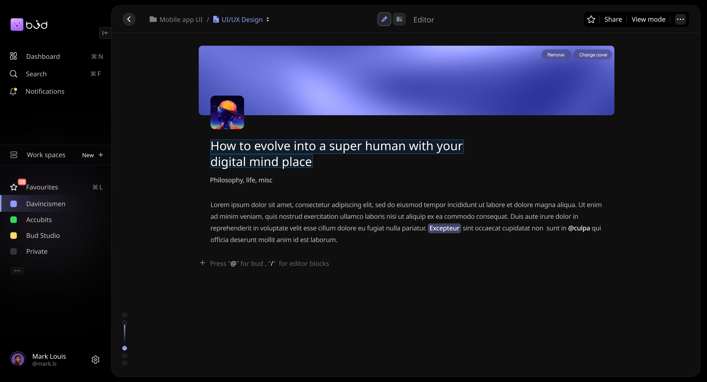

## Bud Studio

Making the world truly Intelligent, one fork at a time

BudStudio is an AI-powered editor, versatile project management and personal notebook application. This Electron app is designed to streamline your workflow and help you stay organized and productive by being a complement to your ideas rather than a road-blocking, thought-hindering tool. It offers a free text editor, the ability to create customizable databases, and seamless switching between different views without data loss. Keep an eye out as this is only the beginning.

 

## Installation

To get started with BudStudio, follow these steps:

1. Clone the repository: `git clone https://github.com/yourusername/BudStudio.git`
2. Navigate to the project directory: `cd BudStudio`
3. Install dependencies: `npm install`
4. For development: `npm start`
5. For production: `npm run package`
   - This command creates a DMG or EXE file, depending on your operating system, for installation.

## Features

- **Unified Workspace:** BudStudio combines project management, task tracking, and personal note-taking in one place, making it easy to manage various aspects of your work.
- **Rich Text Editing:** Enjoy a free text editor that supports various formatting options, allowing you to create and structure content effortlessly.
- **Flexible Databases:** Create databases in the form of tables, kanbans, or lists. Tailor the structure to your needs, whether it's for project details, task tracking, or personal collections.
- **Seamless View Switching:** Toggle between different views without losing your data. Whether you're managing projects or jotting down notes, your work remains accessible.
- **Electron + React:** BudStudio is built on the Electron framework with React, providing a responsive and efficient user interface that you can simply launch and go.

## Contributing

Contributions to BudStudio are welcome! If you'd like to contribute, please follow these guidelines:

1. Fork the repository and create a new branch for your feature or bug fix.
2. Make your changes and test thoroughly.
3. Submit a pull request to the `develop` branch with a clear description of your changes.

## Docs

<!-- ## Backers

## Maintainers -->

## License

BudStudio is released under the [MIT License](./LICENSE).

## Contact

For questions, suggestions, or collaboration opportunities, you can reach out to us at [your@email.com](mailto:your@email.com).
